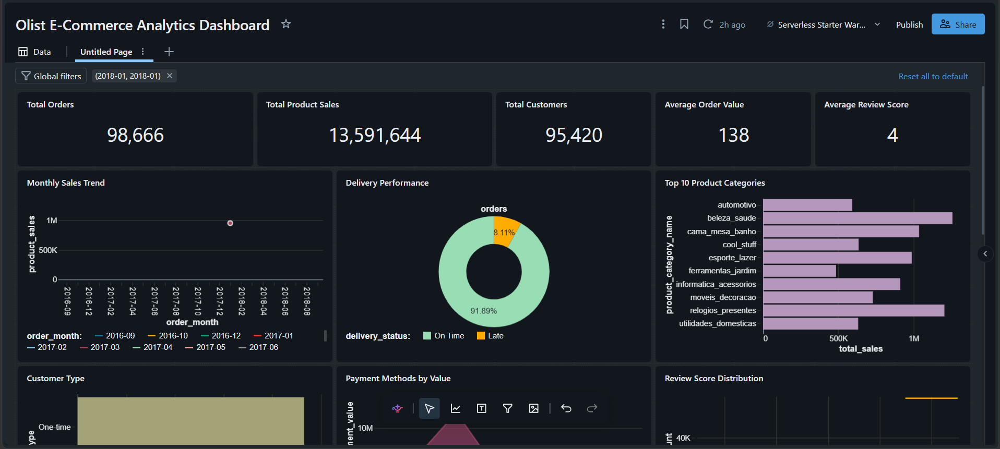
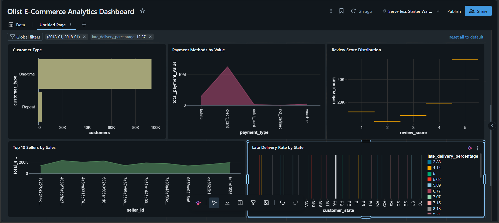

# Olist E-Commerce Data Analysis

## Project Overview

This project analyzes the Brazilian E-Commerce Public Dataset by Olist to understand e-commerce sales performance, customer behavior, product performance, payment methods, delivery performance, and customer satisfaction.

The project was built as an end-to-end Data Analyst portfolio project using SQL and Databricks.

---

## Business Questions

This analysis focuses on questions such as:

- How are sales performing over time?
- Which product categories generate the most sales?
- What percentage of customers are repeat customers?
- Which payment methods are most commonly used?
- How does delivery performance vary across regions?
- Does late delivery relate to lower customer review scores?
- Which sellers generate the highest sales?

---

## Dataset

**Dataset:** Brazilian E-Commerce Public Dataset by Olist

The dataset contains approximately 100,000 orders from the Brazilian e-commerce platform Olist, covering the period from 2016 to 2018.

The dataset contains 9 CSV files covering:

- Orders
- Order Items
- Products
- Customers
- Payments
- Reviews
- Sellers
- Geolocation
- Product Category Translation

The raw dataset is not included in this repository due to file size.

---

## Tools & Technologies

- **SQL**
- **Databricks Free Edition**
- **Git**
- **GitHub**
- **Kaggle Dataset**

---

## Project Workflow

1. Dataset selection
2. GitHub repository setup
3. Databricks environment setup
4. Data ingestion and table creation
5. Data quality checks
6. SQL analysis
7. KPI analysis
8. Dashboard creation
9. Business insights

---

## Data Tables

The following tables were created in Databricks:

- `orders`
- `order_items`
- `products`
- `customers`
- `order_payments`
- `order_reviews`
- `sellers`

---

## Key Performance Indicators

| KPI | Value |
|---|---:|
| Total Orders | 98,666 |
| Total Product Sales | R$13,591,643.70 |
| Total Customers | 95,420 |
| Average Order Value | R$137.75 |
| Average Review Score | 4.03 / 5 |

> KPI values are based on the analysis population with successfully matched order-item and customer records.

---

## Key Insights

### Sales Performance

- Total product sales were approximately **R$13.59 million**.
- Product sales increased by approximately **20% from 2017 to 2018**.
- November 2017 recorded the highest meaningful monthly product sales at approximately **R$1.01 million**.

### Product Performance

- `beleza_saude` generated the highest total sales at approximately **R$1.26 million**.
- `cama_mesa_banho` had the highest item volume with **11,115 items**.
- `instrumentos_musicais` had the highest average item price among categories with at least 500 items, at approximately **R$281.62**.
- Product category information was missing for **610 products**, representing **1,603 items** and approximately **R$179,535** in product sales.

### Customer Behavior

- Approximately **3.12% of customers were repeat customers**.
- Repeat customers generated a higher average sales value per customer than one-time customers.
- This suggests that customer retention represents an opportunity for business growth.

### Payment Behavior

- **Credit cards accounted for approximately 78.34% of total payment value**.
- Boleto was the second-largest payment method, contributing approximately **17.92%** of payment value.

### Delivery Performance

- Average delivery time was approximately **12.5 days**.
- Approximately **8.11% of orders with recorded delivery dates were delivered late**.
- The average delay among late deliveries was approximately **8.87 days**.
- Delivery performance varied considerably across Brazilian states.

### Customer Satisfaction

- The average review score was **4.03 / 5**.
- Approximately **77% of valid reviews were 4 or 5 stars**.
- Orders delivered on time had an average review score of **4.29**, compared with **2.57** for late deliveries.
- This indicates a strong association between delivery performance and customer satisfaction, although the analysis does not establish causation.

---

## Dashboard

The project includes a Databricks dashboard covering:

- Key Performance Indicators
- Delivery Performance
- Top Product Categories
- Customer Type
- Payment Methods
- Review Score Distribution
- Top Sellers by Sales
- Late Delivery Performance by State

## Dashboard Preview





---

## SQL Analysis

The SQL analysis is organized into separate files:

```text
sql/
├── 01_kpi_analysis.sql
├── 02_sales_analysis.sql
├── 03_product_analysis.sql
├── 04_customer_analysis.sql
├── 05_delivery_analysis.sql
└── 06_payment_review_analysis.sql